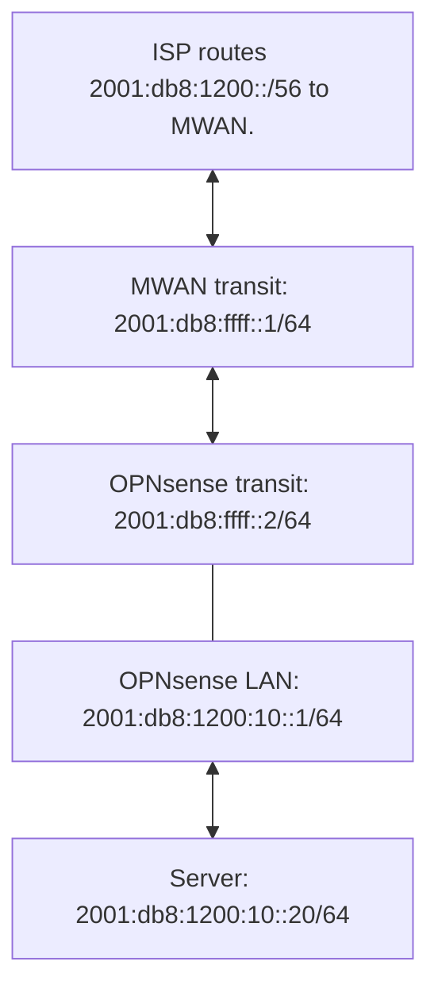

# Public IPv6 addresses behind downstream BGP routers

This approved specification requires configuration for downstream routers to
use selected public IPv6 addresses unchanged. Existing clients can continue
using synthetic addresses, translation, and load balancing concurrently.
This document specifies planned behavior, not a completed implementation.

## Address use and route advertisements

A prefix is a block of addresses. A host uses an address from that block.
A BGP advertisement tells another router where to forward packets destined
for the block. BGP does not assign addresses to hosts.

The downstream router advertises its public LAN prefix to MWAN. MWAN uses
that route for inbound delivery. The downstream router uses a default route
through MWAN for outbound packets. MWAN preserves the public source address
and selects a compatible upstream connection.

Unchanged addresses do not require unchanged BGP attributes. Next hops and
other attributes retain normal BGP semantics. Advertising a public block
from MWAN toward OPNsense does not allocate that block or establish the
return route to its hosts.

## OPNsense example

Assume an ISP routes `2001:db8:1200::/56` to MWAN. These are documentation
addresses, not deployment values. The transit network between routers is
separate from the public LAN subnet.

| OPNsense setting | Example value |
| --- | --- |
| Transit interface IPv6 address | `2001:db8:ffff::2/64` |
| Public LAN or VLAN IPv6 address | `2001:db8:1200:10::1/64` |
| BGP neighbor | `2001:db8:ffff::1` |
| IPv6 BGP network announcement | `2001:db8:1200:10::/64` |
| Outbound route | Learn `::/0` from MWAN. |
| Translation policy | Preserve addresses for the selected native traffic. |

The server uses `2001:db8:1200:10::20/64` and gateway
`2001:db8:1200:10::1`. Router advertisements can instead provide automatic
client addressing and gateway discovery. Both routers retain firewall
policy; public addressing does not permit every inbound connection.

The ISP delivers replies to MWAN. The route announced by OPNsense selects
OPNsense as the next hop for the public LAN. OPNsense delivers the reply to
the server. The ISP can provide the block through static routing, DHCPv6
delegation, or routing established with BGP.

OPNsense's [IPv6 configuration](https://docs.opnsense.org/manual/ipv6.html)
and [FRR configuration](https://docs.opnsense.org/manual/dynamic_routing.html)
provide the interface and routing controls used in this example.

## Configuration contract

Configure which downstream peers use public addresses directly. Trust their
BGP announcements as declarations of address use. Support subnets and `/128`
addresses without requiring a separate MWAN entry for every announced range.
Keep synthetic-address announcements distinct through the configured peer
policy. Extend the existing typed configuration model.

Configure the public blocks supported by each upstream, using configured
prefixes or current delegated prefixes. Match announced source ranges to
those blocks to select compatible upstreams. This mapping determines packet
routing, not permission to claim an address. A route without a compatible
upstream remains visible with an unavailable external path.

An upstream assignment must authorize the range and provide a return path
to MWAN. A connected ISP subnet alone is not a routed downstream allocation.
ISP interface-address sharing, bridging, and Neighbor Discovery proxy are
separate work.

Derive the return route and translation exceptions from active public-address
routes learned from configured peers. Preserve existing BGP behavior for
unrelated internal prefixes. Do not allocate addresses, verify ownership,
reserve ranges, or reject duplicates. Peers coordinate address use themselves.

## Shared addresses and overlapping routes

Do not reject an address or prefix merely because multiple peers use or
advertise it. Redundant routers can advertise the same subnet. Preserve
existing BGP path selection and failover for that case.

Stateful NAT can share an external address by tracking connections and
translating ports. Stateless NPT translates prefixes without that connection
tracking. It cannot distinguish two independent destinations solely from an
identical destination address.

An active public-address route creates an inbound exception before reverse
NPT and an outbound exception before source translation. Matching packets
retain their addresses. Ordinary routing selects the most specific route
and uses BGP path selection between routes for the same prefix.

These exceptions implement forwarding, not address-ownership enforcement.
Do not reject announcements because they overlap translated addresses.
Peers remain responsible for avoiding unintended address conflicts. If a
translated client also uses that exact external address, the native exception
determines inbound delivery; this feature does not resolve the conflict or
provide port-sharing NAT.

Remove a learned exception when its last applicable public-address route is
withdrawn under the existing BGP lifecycle. Retain it when another applicable
peer still supplies the route. Existing translation then applies wherever no
remaining native exception matches.

## Forwarding and failure behavior

Select compatible upstreams using the native public source range before
ordinary load balancing. Preserve addresses in both directions according to
the configured translation precedence. Preserve existing behavior for
synthetic-address clients outside those native exceptions.

Use provider-specific addresses only through compatible upstreams. If no
compatible path is usable, report the unavailable range and stop forwarding
its external traffic. Do not silently translate it or use an unrelated ISP.
A portable range can use several explicitly configured upstreams when each
supports that range.

Peer withdrawal removes learned return routes through the existing BGP
lifecycle. Upstream failure does not require deleting a valid internal LAN
route or withdrawing a shared default needed by other clients. Track
downstream route availability and upstream eligibility separately.

Prefix expiry or replacement changes upstream eligibility. Preserve native
exceptions while their downstream routes remain active, even if no upstream
is usable; loss of an upstream must not silently enable address translation.
Reconcile source policy without modifying unrelated state.
Expose the resolved prefix, downstream route, eligible upstreams, and reason
for inactivity. Record changes and recovery through existing status and event
interfaces. Restore valid state after restart.

BGP does not renumber OPNsense interfaces or clients. A changing delegation
requires corresponding downstream addressing and announcement updates before
the replacement range becomes usable. Expose that requirement without adding
a separate OPNsense configuration management system.

## Implementation boundaries

The inspected BGP implementation installs learned IPv6 return routes. The
translation model supports native mode per provider and family. This feature
requires native handling for selected ranges alongside translated traffic.
Reuse the existing routing, translation, and firewall owners.

The first slice is IPv6 and preserves existing IPv4 behavior. External BGP,
tunnel construction, Internet route redistribution, and automatic address
allocation are separate concerns. MWAN-507 can supply compatible external
path state later. Ordinary upstream support does not depend on its completion.
Keep providers, ASNs, prefixes, and subnet lengths configurable.

## Acceptance requirements

Use real peers and downstream clients through public configuration and packet
interfaces. Require these outcomes:

1. Public subnets and `/128` routes support unchanged addresses in both
   directions. Permitted inbound TCP works without a preceding outbound session.
2. Synthetic-address clients continue translation and load balancing.
   Observe packets at provider ingress before simulator NAT.
3. Redundant peers can advertise the same prefix. Withdrawal and recovery
   select the expected route and restore delivery without a daemon restart.
4. A public-address announcement automatically creates the native exceptions.
   Overlap does not cause rejection. Native delivery precedes reverse NPT.
   Final withdrawal removes the exceptions; redundant announcements retain them.
5. Upstream loss stops incompatible external forwarding for the affected range.
   Other ranges remain usable, and recovery restores the affected range.
6. Prefix expiry or replacement disables incompatible external forwarding
   without translating an active native range. Replacement addressing and
   announcements restore service after downstream configuration agrees.
7. Restart and policy removal preserve unrelated routes and translation.
8. A non-BGP upstream passes independently. Repeat with an upstream BGP path
   when compatible features exist and record those results separately.

## Tickets

[MWAN-528](https://tack.home.goodkind.io/browse/MWAN-528) implements the policy
and runtime behavior with public-boundary regression coverage.

[MWAN-529](https://tack.home.goodkind.io/browse/MWAN-529) depends on MWAN-528
and provides OPNsense testbed acceptance, configuration examples, packet
evidence, and recovery results. Both tickets are separate from MWAN-507.
No deployment or packet acceptance has occurred for this feature.
