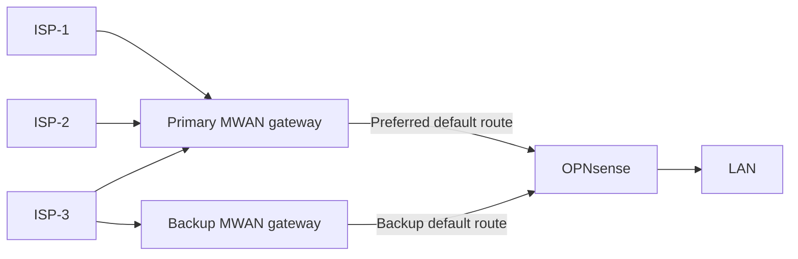

# MWAN

MWAN is a Linux gateway that selects an internet provider for each connection
and supplies a backup route when the primary gateway fails. OPNsense remains
the LAN firewall.

This overview is for network operators and developers. It covers current
behavior, safety controls, and planned routing work.

## Why it was built

OPNsense gateway groups require explicit gateway choices in firewall rules
that otherwise use the default route. Small rule or group changes can then
interrupt internet access. Gateway group failures in this deployment were
also difficult to diagnose.

MWAN moves provider selection to Linux. OPNsense keeps its ordinary firewall
rules; MWAN uses netlink, nftables, and traffic control BPF to manage the
provider paths.

## How it works today

The primary gateway uses multiple providers. ISP-1 and ISP-2 represent the
first preference tier. ISP-3 represents a later tier and the backup uplink.
These ISP labels are examples.

The backup gateway uses one provider and masquerades outbound traffic. It
does not balance providers or serve inbound traffic.

## Components

- [Configuration and interfaces](#configuration-and-interfaces)
- [Provider health and steering](#provider-health-and-steering)
- [Firewall and translation](#firewall-and-translation)
- [BGP and gateway failover](#bgp-and-gateway-failover)
- [Watchdog and recovery](#watchdog-and-recovery)
- [Deployment safety](#deployment-safety)
- [Management and diagnostics](#management-and-diagnostics)

## Configuration and interfaces

The [pinned configuration template](https://github.com/agoodkind/configs/blob/20ad40232fa62394046b1218839e60756a6b7a22/mwan/config/network.json.j2)
renders inventory into `/etc/mwan/network.json`. Each provider sets:

- Its link and addresses define the network attachment.
- Its translation and health checks define usable paths.
- Its preference tier and weight control provider selection.

The interface manager validates the JSON against its YANG schema, then
reconciles interfaces, routes, and packet policy. The gateway can add a
supported provider through configuration and deployment.

The model uses [RFC 8343 for interfaces](https://www.rfc-editor.org/rfc/rfc8343),
[RFC 8344 for IP addresses](https://www.rfc-editor.org/rfc/rfc8344),
[RFC 8349 for routing](https://www.rfc-editor.org/rfc/rfc8349), and
[RFC 8512 for translation](https://www.rfc-editor.org/rfc/rfc8512).
The [local steering model](superpowers/wanconfig/model.md) adds provider
settings. BGP peers and credentials still use TOML.

## Provider health and steering

The interface manager checks each provider's IPv4 and IPv6 paths against
configured failure and recovery thresholds. The primary gateway assigns new
connections in the first available preference tier only when health, routing,
and translation are ready for that family. IPv4 failure does not disable a
working IPv6 path, or vice versa.

OPNsense can mark a packet with a Differentiated Services Code Point (DSCP)
to request a specific provider. MWAN maps that value to a routing table. A
connection keeps its provider choice.

## Firewall and translation

The interface manager installs a protective firewall baseline before it
loads the rest of the gateway configuration. It reconciles filtering and
IPv4 translation with nftables and configures traffic control BPF for IPv6
prefix translation.

| Family | Translation |
| --- | --- |
| IPv4 | MWAN preserves, masquerades, or statically maps source addresses. |
| IPv6 | MWAN preserves or translates source prefixes. |

The current Network Prefix Translation (NPTv6) implementation accepts
canonical prefixes no longer than /64. When a provider uses delegated NPTv6,
a missing delegation disables that provider's IPv6 path.
The [packet example](mwan-example.md) shows translation and provider
selection with illustrative addresses.

## BGP and gateway failover

The `mwan agent` process runs Border Gateway Protocol (BGP) sessions and
serves the gateway API. Both gateways advertise default routes to OPNsense.
OPNsense prefers the primary route and selects the backup after BGP converges.
Existing connections may need to reconnect because the gateways do not share
connection state.

With BGP Graceful Restart enabled, the agent stops without explicitly
withdrawing its default route. Without it, the agent withdraws the route
before a controlled stop. The backup container runs its own interface
manager and agent.

## Watchdog and recovery

The `mwan watchdog` process runs on the hypervisor and checks:

- IPv4 and IPv6 probes test external connectivity.
- VM state shows whether the gateway is running.
- Provider health identifies affected uplinks.
- Deploy time and configuration hash identify recent changes.

Sustained healthy operation produces a known-good VM snapshot.

After a recent configuration change, sustained connectivity failure can
trigger snapshot rollback. Without a recent change, the watchdog diagnoses
the failure and can trigger BGP failover to the backup container. The
[failover guide](ops/mwan/failover.md) covers the recovery decisions.

## Deployment safety

Production deployment follows this sequence:

1. Deployment verifies the pinned release and existing internet access.
2. Deployment creates a pre-deploy snapshot and validates the new network
   JSON and firewall before installing them.
3. After reboot, the hypervisor checks the boot ID, internet access, and
   mapped IPv4 addresses. The controller accepts only a verdict for the
   current deploy run.

Failed egress can start rollback. A missing reboot,
missing verdict, or missing mapped address fails the deployment; the
watchdog remains the recovery authority if the controller cannot reconnect.
The [deploy gate design](superpowers/deploygate/spec.md) covers that outage
case.

## Management and diagnostics

The interface manager can publish configuration and live state through a
read-only YANG management surface. The agent serves its API over TCP and,
when available, VM sockets. The hypervisor can use that API to request route
changes when guest networking is unavailable. OPNsense uses virtio serial
for management. A shared notifier reports health, failover, and recovery
state changes.

The agent, interface manager, and watchdog write JSON logs to standard
output. The agent and interface manager systemd units record those logs in
the journal. Configured log files add another destination. These daemons do
not send logs directly to syslog.

## Planned routing

The [multiple router design](superpowers/multirouter/spec.md) adds more LAN
routers. Each router would peer with both gateways and announce the IPv6
prefixes it serves. The gateways would install return routes for those
prefixes.

MWAN-507 plans direct upstream external BGP (eBGP) and three tunnel
arrangements:

- A tunnel to a remote router uses configured return routes. The remote
  router handles upstream BGP.
- MWAN can peer with an upstream router over a tunnel.
- MWAN can peer with a VPS over a tunnel while the VPS peers upstream.

Each tunnel also transports IPv6 packets. MWAN-507 plans to define new
upstream peer and tunnel settings in the network JSON. These arrangements
are not implemented. The plan also includes more detailed network analytics.

## Performance

The guest kernels forward packets. The host copies packets between the
OPNsense and MWAN guests across their shared bridge. The
[performance analysis](performance.md) records the measured cost and the
planned XR11 offload investigation.
