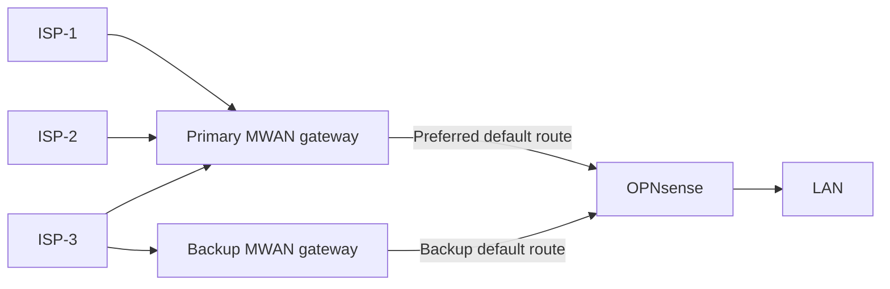
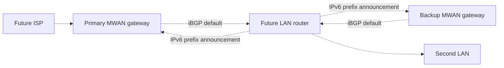
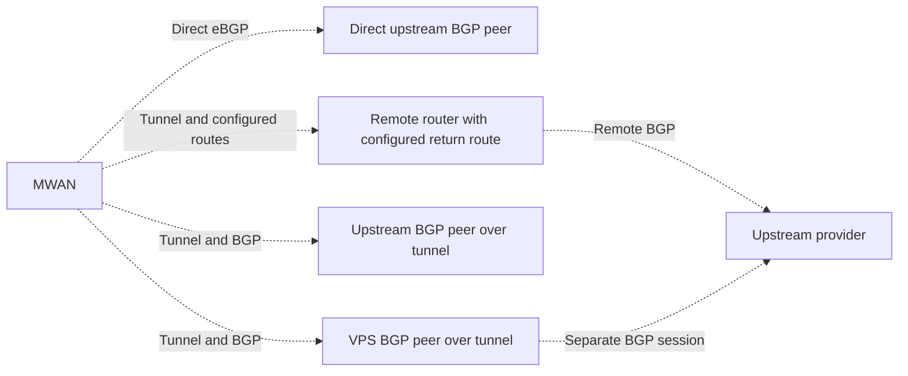

# MWAN

MWAN lets OPNsense keep its ordinary firewall rules while a separate gateway
selects the internet provider for each connection.

## Why it was built

OPNsense gateway groups made the original multi-WAN setup fragile. A normal
single-WAN rule could use its default gateway. With gateway groups, the
firewall needed explicit gateway choices in rules that previously worked
without them. Recreating those choices added many places where a small rule
or group change could interrupt internet access. Gateway group failures in
this deployment were also difficult to diagnose.

MWAN moved provider selection out of OPNsense. OPNsense applies its usual LAN
policy and forwards internet traffic to MWAN. Provider policy can change
without adding one firewall policy per ISP.

MWAN runs its packet path on Linux. It uses netlink, nftables, and traffic
control BPF. OPNsense runs on FreeBSD. The Linux packet path cannot run
there unchanged. OPNsense remains the LAN firewall while MWAN controls
provider selection and routing.

OPNsense [disables several NIC offloads by default](https://docs.opnsense.org/manual/interfaces_settings.html)
and [disables system-wide receive-side scaling by default](https://docs.opnsense.org/troubleshooting/performance.html).
[IPS mode requires hardware offloads to be disabled](https://docs.opnsense.org/manual/ips.html).
The available acceleration depends on the selected features, driver, and
hardware.

## Components

- [Configuration and interfaces](#configuration-and-interfaces)
- [Provider health and steering](#provider-health-and-steering)
- [Firewall and translation](#firewall-and-translation)
- [BGP agent and gateway failover](#bgp-agent-and-gateway-failover)
- [Watchdog and recovery](#watchdog-and-recovery)
- [Deployment safety](#deployment-safety)
- [Management and diagnostics](#management-and-diagnostics)

## How it works today

The primary MWAN gateway connects to multiple providers. The backup gateway
uses one provider. The diagram uses ISP-1 and ISP-2 for a first
configured preference tier and ISP-3 for a later tier and the backup uplink.
These labels illustrate the roles, not production provider names.

The backup gateway does not balance providers. It masquerades outbound traffic
on its configured uplink and does not serve inbound traffic.

## Configuration and interfaces

Those provider roles come from configuration. The
[pinned configuration template](https://github.com/agoodkind/configs/blob/20ad40232fa62394046b1218839e60756a6b7a22/mwan/config/network.json.j2)
renders inventory into `/etc/mwan/network.json`. Each provider entry sets
its link, addresses, translation, health checks, steering tier, and weight.
The gateway interface manager, `mwan ifmgr --role wan`, validates that JSON
against its YANG network schema. It then writes provider network files and
reconciles the configured interfaces, routes, and packet policy. A supported
provider needs a configuration change and deployment, not a new binary.

The model uses [RFC 8343 for interfaces](https://www.rfc-editor.org/rfc/rfc8343),
[RFC 8344 for IP addresses](https://www.rfc-editor.org/rfc/rfc8344),
[RFC 8349 for routing](https://www.rfc-editor.org/rfc/rfc8349), and
[RFC 8512 for translation](https://www.rfc-editor.org/rfc/rfc8512).
The [local steering model](superpowers/wanconfig/model.md) adds MWAN's
provider settings. Existing BGP peer settings and credentials remain in
TOML. MWAN-507 plans to model new upstream BGP and tunnel settings in the
network configuration.

## Provider health and steering

The interface manager probes each configured provider and records a health
verdict after its configured failure or recovery threshold. It reconciles
provider routes and rules before steering new connections. A link with no
usable route or required translation cannot serve that address family.

The primary gateway selects a healthy ISP in the first available preference
tier for each new connection. OPNsense can request a specific ISP by setting
a Differentiated Services Code Point (DSCP) value on the packet. MWAN reads
that value, assigns the ISP's internal firewall mark, and uses the matching
routing table. The connection keeps that ISP choice.

When a tier has no eligible provider, the primary gateway selects the next
tier for new connections. A failed IPv6 path does not disable a working IPv4
path.

## Firewall and translation

The interface manager installs a protective firewall baseline before it
loads the rest of the gateway configuration. Its firewall module then
reconciles filtering and IPv4 translation. The IPv6 translator configures
traffic control BPF for providers that use prefix translation.

MWAN either preserves an IPv6 source address or applies Network Prefix
Translation (NPTv6), according to the ISP configuration. NPTv6 substitutes
the configured external prefix and adjusts a 16-bit address word to preserve
transport checksums. Internal and external
prefix lengths can differ. The current translator accepts canonical IPv6
prefixes no longer than /64. A delegated prefix must cover the external
prefix that MWAN uses. A missing delegation makes that provider's IPv6 path
unavailable until a valid prefix appears.

MWAN either preserves an IPv4 source address or translates it, according to
the ISP configuration. Masquerade replaces an internal source with the ISP
interface's address. A configured static mapping instead pairs one internal
address with one external address in both directions. OPNsense can also
translate a client's IPv4 source to its transit address before MWAN selects
the ISP.

The [translation model](superpowers/wanconfig/translation.md) defines the
address and readiness requirements that this overview omits.

## BGP agent and gateway failover

The `mwan agent` process runs Border Gateway Protocol (BGP) sessions and
serves the gateway API.
Both gateways advertise a default route to OPNsense. OPNsense prefers the
primary gateway's route. The hypervisor uses the API to inspect the gateway
and request route changes during failover.

Without BGP Graceful Restart, the agent withdraws its default route before
a controlled stop. With Graceful Restart enabled, the agent stops without an
explicit withdrawal and OPNsense can retain the route during the restart.
If the primary gateway fails, OPNsense selects the backup default after BGP
converges. Existing connections may need to reconnect because the backup
gateway does not share the primary gateway's connection state.

The backup container runs the failover interface manager to monitor its
uplink. Its agent advertises the backup default route.

## Watchdog and recovery

The `mwan watchdog` process runs on the hypervisor. It probes IPv4 and IPv6
connectivity and checks whether the gateway VM is running. The gateway
sends provider health and active tier status to the watchdog for diagnosis.
The watchdog also compares the gateway's configuration hash with its previous
reading and checks the last deploy time.

After sustained healthy operation, the watchdog creates a known-good VM
snapshot. On rollback, it prefers the latest pre-deploy snapshot and then
a known-good snapshot. It checks that the guest filesystem thawed after a
snapshot attempt and leaves locks for active Proxmox tasks alone. When both
address families fail after a recent configuration change, the watchdog
allows the deploy grace period, then can restore a rollback snapshot. A
failure without a recent configuration change prompts diagnosis and may
trigger BGP failover to the backup container. The watchdog does not restore
the gateway for every internet outage. The [failover guide](ops/mwan/failover.md)
covers the recovery decisions and snapshot rules.

## Deployment safety

The deployment verifies the pinned release and checks existing internet
access. Production deployment stops if that baseline is unhealthy. With a
healthy baseline, it creates a pre-deploy VM snapshot. Ansible renders the
network JSON and runs the released `mwan deploy-gate` loader and firewall
checks before writing it to the gateway.

After reboot, a gate on the hypervisor verifies a new boot ID. It tests
internet access for the required address families and checks mapped IPv4
addresses on provider links. It writes one verdict for the
deploy run on the hypervisor. The controller accepts only a verdict with the
matching run identifier and previous boot identifier.

A reboot that never happened or an uncollected verdict fails the deployment
without rollback. Failed egress can start the deployment rollback path.
A missing mapped address fails the postdeploy check. The gate attempts an
alert and leaves the deployed VM running. The watchdog remains the recovery
authority when the controller cannot reconnect. The
[deploy gate design](superpowers/deploygate/spec.md)
explains the controller outage case.

## Management and diagnostics

The interface manager publishes configuration and live state through a
YANG management surface when enabled. The surface does not accept writes.
The agent serves its API over TCP and, when available, VM sockets
(vsock). With vsock, the hypervisor can inspect the gateway and request
route changes when guest networking is unavailable.
OPNsense uses virtio serial for its management channel. The watchdog controls
the backup container through host container operations. A shared notifier
reports health, failover, and recovery changes without sending one message
per failed probe.

## Worked example

These addresses and names illustrate the architecture. They are not
production configuration. The IPv4 ISP blocks use TEST-NET space. The public
IPv6 blocks use `2001:db8::/32`, the IPv6 documentation range. The internal
`fd06::/56` block is an example of a unique local IPv6 address, not an IPv6
documentation prefix. ASN `64496` is reserved for examples.

| Provider | Example IPv4 block | Example IPv6 prefix | Role |
| --- | --- | --- | --- |
| ISP-1 | `192.0.2.0/29` | `2001:db8:1::/56` | Primary balance tier |
| ISP-2 | `198.51.100.0/29` | `2001:db8:2::/56` | Primary balance tier |
| ISP-3 | `203.0.113.0/29` | `2001:db8:3::/56` | Next tier and failover uplink |

A client with source `fd06::10` sends an IPv6 packet through OPNsense.
MWAN selects ISP-1 and translates the source from `fd06::/56` into
`2001:db8:1::/56`. NPTv6 also adjusts an address word for checksum
neutrality, so replacing the prefix text alone does not calculate the exact
external host address. Replies use the reverse translation.

For IPv4, OPNsense can translate client `10.0.0.10` to its transit address
`192.0.2.9`. A static mapping on ISP-2 can then translate that source to
`198.51.100.1`. Without that mapping, ISP-2 masquerades the transit source.

A LAN normalization rule can make OPNsense stamp DSCP CS1 before it forwards
a packet. If ISP-1 is configured to match CS1, MWAN selects ISP-1 before
balancing unmarked connections. The DSCP setting survives the router's IPv4
source translation.

## How the design can grow

The planned multiple router design extends the current BGP relationship.
Each LAN router peers with
both MWAN gateways and announces the IPv6 prefixes it serves. The gateways
then install return routes for those prefixes. IPv4 clients still use each
router's transit source address. A new router adds its own peer configuration
without adding an MWAN router inventory entry. The
[multiple router design](superpowers/multirouter/spec.md) specifies that work.

The provider model also permits an additional ISP. Provider membership and
translation remain gateway settings. The downstream router still receives a
default route from MWAN.

For example, a future ISP-N could use `192.0.2.16/29` and
`2001:db8:10::/56`. A future `router-2` could announce
`fd06:0:0:10::/60` over iBGP. These example addresses are not production
configuration.

Dashed connections show planned behavior.

## Future upstream BGP and tunnels

MWAN-507 plans direct upstream external BGP (eBGP) and three tunnel
arrangements. These external routing capabilities are not implemented yet.
BGP exchanges routes. A tunnel encapsulates ordinary packets. A BGP session
on a tunnel is optional and depends on the arrangement.

In the configured route arrangement, MWAN has no BGP session on the tunnel.
In the upstream peer arrangement, MWAN exchanges routes with the upstream
router over the tunnel. In the VPS arrangement, MWAN peers with the VPS, and
the VPS runs a separate upstream BGP session. Each tunnel arrangement also
transports ordinary IPv6 packets. The planned routing model sets readiness
and withdrawal requirements.

The longer term plan also includes more detailed network analytics. Those
plans do not change OPNsense's LAN firewall role.

## Performance

The current guest arrangement uses host CPU to transfer packets between the
router and gateway guests. The [performance analysis](performance.md) records
the measured cost, compares attachment paths, and tracks the planned XR11
offload investigation.
