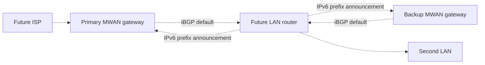
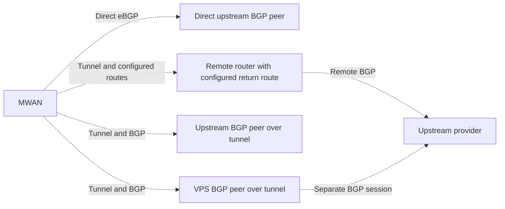

# MWAN

MWAN lets OPNsense keep its ordinary firewall rules while a separate gateway
selects the internet provider for each connection.

## Why it was built

OPNsense gateway groups made the original multi-WAN setup fragile. A normal
single-WAN rule could use its default gateway. With gateway groups, the
firewall needed explicit gateway choices in rules that previously worked
without them. Recreating those choices added many places where a small rule
or group change could interrupt internet access. Gateway group failures in
this deployment were also difficult to diagnose.

MWAN moved provider selection out of OPNsense. OPNsense applies its usual LAN
policy and forwards internet traffic to MWAN. MWAN selects an ISP, translates
addresses when required, and selects another healthy ISP for new connections
after a provider failure. OPNsense does not need one firewall policy per ISP.

## How it works today

The primary MWAN gateway balances new connections across healthy providers.
ISP-1 and ISP-2 serve the first preference tier. ISP-3 serves the next tier
when the first tier is unavailable. A backup MWAN gateway also uses ISP-3
when the primary gateway fails.

Both gateways run BGP and advertise a default route to OPNsense. OPNsense
prefers the primary gateway's route.

The backup gateway does not balance providers. It masquerades outbound traffic
on ISP-3 and does not serve inbound traffic. A watchdog on the hypervisor can
restore the primary gateway from a snapshot after a failed deployment.

## How MWAN selects a provider

The primary gateway selects a healthy ISP in the first available preference
tier for each new connection. OPNsense can request a specific ISP by setting
a Differentiated Services Code Point (DSCP) value on the packet. MWAN reads
that value, assigns the ISP's internal firewall mark, and uses the matching
routing table. The connection keeps that ISP choice.

MWAN either preserves an IPv6 source address or applies Network Prefix
Translation (NPTv6), according to the ISP configuration. NPTv6 substitutes
the configured external prefix and adjusts a 16-bit address word to preserve
transport checksums. Internal and external
prefix lengths can differ. The current translator accepts canonical IPv6
prefixes no longer than /64. A delegated prefix must cover the external
prefix that MWAN uses. A missing delegation makes that provider's IPv6 path
unavailable until a valid prefix appears.

MWAN either preserves an IPv4 source address or translates it, according to
the ISP configuration. Masquerade replaces an internal source with the ISP
interface's address. A configured static mapping instead pairs one internal
address with one external address in both directions. OPNsense can also
translate a client's IPv4 source to its transit address before MWAN selects
the ISP.

The [translation model](superpowers/wanconfig/translation.md) defines the
address and readiness requirements that this overview omits.

## How failover works

When a balance tier has no healthy provider for an address family, the
primary gateway selects an eligible provider in the next tier for new
connections. An unavailable IPv6 path does not disable a working IPv4 path.

For planned maintenance, the primary gateway withdraws its BGP default route
before stopping. If the primary gateway fails unexpectedly, OPNsense selects
the backup default route after the BGP session expires. Existing connections
may need to reconnect because the backup gateway uses ISP-3 masquerade and
does not preserve the primary gateway's connection state.

## Worked example

These addresses and names illustrate the architecture. They are not
production configuration. The IPv4 ISP blocks use TEST-NET space. The public
IPv6 blocks use `2001:db8::/32`, the IPv6 documentation range. The internal
`fd06::/56` block is an example of a unique local IPv6 address, not an IPv6
documentation prefix. ASN `64496` is reserved for examples.

| Provider | Example IPv4 block | Example IPv6 prefix | Role |
| --- | --- | --- | --- |
| ISP-1 | `192.0.2.0/29` | `2001:db8:1::/56` | Primary balance tier |
| ISP-2 | `198.51.100.0/29` | `2001:db8:2::/56` | Primary balance tier |
| ISP-3 | `203.0.113.0/29` | `2001:db8:3::/56` | Next tier and failover uplink |

A client with source `fd06::10` sends an IPv6 packet through OPNsense.
MWAN selects ISP-1 and translates the source from `fd06::/56` into
`2001:db8:1::/56`. NPTv6 also adjusts an address word for checksum
neutrality, so replacing the prefix text alone does not calculate the exact
external host address. Replies use the reverse translation.

For IPv4, OPNsense can translate client `10.0.0.10` to its transit address
`192.0.2.9`. A static mapping on ISP-2 can then translate that source to
`198.51.100.1`. Without that mapping, ISP-2 masquerades the transit source.

A LAN normalization rule can make OPNsense stamp DSCP CS1 before it forwards
a packet. If ISP-1 is configured to match CS1, MWAN selects ISP-1 before
balancing unmarked connections. The DSCP setting survives the router's IPv4
source translation.

## How the design can grow

The planned multiple router design extends the current BGP relationship.
Each LAN router peers with
both MWAN gateways and announces the IPv6 prefixes it serves. The gateways
then install return routes for those prefixes. IPv4 clients still use each
router's transit source address. A new router adds its own peer configuration
without adding an MWAN router inventory entry. The
[multiple router design](superpowers/multirouter/spec.md) specifies that work.

The provider model also permits an additional ISP. Provider membership and
translation remain gateway settings. The downstream router still receives a
default route from MWAN.

For example, a future ISP-N could use `192.0.2.16/29` and
`2001:db8:10::/56`. A future `router-2` could announce
`fd06:0:0:10::/60` over iBGP. These example addresses are not production
configuration.

Dashed connections show planned behavior.

## Future upstream BGP and tunnels

MWAN-507 plans direct upstream external BGP (eBGP) and three tunnel
arrangements. These external routing capabilities are not implemented yet.
BGP exchanges routes. A tunnel encapsulates ordinary packets. A BGP session
on a tunnel is optional and depends on the arrangement.

In the configured route arrangement, MWAN has no BGP session on the tunnel.
In the upstream peer arrangement, MWAN exchanges routes with the upstream
router over the tunnel. In the VPS arrangement, MWAN peers with the VPS, and
the VPS runs a separate upstream BGP session. Each tunnel arrangement also
transports ordinary IPv6 packets. The [routing model](superpowers/wanconfig/model.md)
defines readiness and withdrawal requirements.

The longer term plan also includes more detailed network analytics. Those
plans do not change OPNsense's LAN firewall role.

## Management and performance

The hypervisor communicates with the primary gateway VM over vsock when
guest networking is unavailable. The OPNsense VM uses virtio serial for its
management channel. The watchdog controls the failover Linux container
through the host's container operations. These paths let the host inspect
guest state and perform recovery without relying on the guest's IP route.

The current guest arrangement uses host CPU to transfer packets between the
router and gateway guests. The [performance analysis](performance.md) records
the measured cost, compares attachment paths, and tracks the planned XR11
offload investigation.
